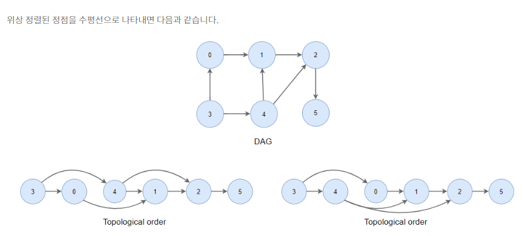
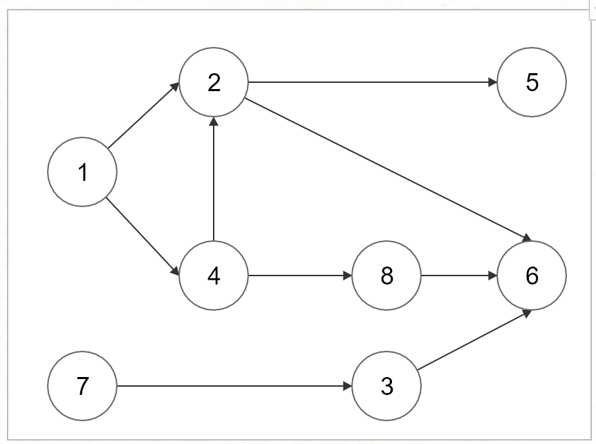

# 위상정렬



### 정의 

---

- 그래프와 관련된 알고리즘 중 하나.

- 선후관계가 정해져있는 그래프를 정렬하는 방법

- 위상 정렬 활용예로 대학교 선수과목을 들 수 있습니다.

  - 특정 수강과목에 선수과목이 있다면 그 선수과목부터 수강해야 합니다. 여기서 위상 정렬은 특정 수강과목을 위해 필요한 선수과목의 정렬입니다.

  

### 특징 (최대 30분)

---

- 비순환 방향그래프(DAG)에서 가능
  - 방향그래프
  - 사이클 없어야

### 구현 (최대 30분)

---



``` java
import java.io.*;
import java.util.ArrayList;
import java.util.ArrayDeque;
import java.util.Queue;

//1에서 8번까지의 노드가 있다고 가정
public class TopologicalSort{
    public static void main(String[] args) throws IOException{
        BufferedWriter bw = new BufferedWriter(new OutputStreamWriter(System.out));


        //1~8번 노드의 진입차수 저장용 배열
        int[] edgeCount = new int[9];

        //위상정렬에 사용할 그래프를 2차원 리스트로 구현
        ArrayList<ArrayList<Integer>> graph = new ArrayList<>();
        for(int i=0;i<=8;i++){//graph.idx == idx번노드
            graph.add(new ArrayList<>());//idx번 리스트에는 idx번 노드가 갈 수 있는 노드번호가 있다
        }

        //그래프 각 노드별 인접한 노드정보 초기화
        //graph.get(from).add(to) -- from은 to에 갈 수 있다
        graph.get(1).add(2);
        graph.get(1).add(4);
        graph.get(2).add(5);
        graph.get(2).add(6);
        graph.get(3).add(6);
        graph.get(4).add(2);
        graph.get(4).add(8);
        graph.get(7).add(3);
        graph.get(8).add(6);


        //진입차수 테이블 초기화
        edgeCount[2] = 2;
        edgeCount[3] = 1;
        edgeCount[4] = 1;
        edgeCount[5] = 1;
        edgeCount[6] = 3;
        edgeCount[8] = 1;

        //위상정렬에 사용할 큐
        Queue<Integer> q = new ArrayDeque<>();
        //진입차수가 0인 노드 큐에 넣기
        for(int i=1;i< edgeCount.length;i++){//1번노드부터 8번
            if(edgeCount[i]==0){
                q.offer(i);
            }
        }

        while(!q.isEmpty()){
            //큐에서 현재노드 cur 꺼내기
            int cur = q.poll();

            //현재노드 cur 기록
            bw.write(String.valueOf(cur)+" ");

            //cur의 인접노드 찾기
            ArrayList<Integer> nearNodeList = graph.get(cur);

            //인접노드 순회
            for(int nearNode:nearNodeList){
                edgeCount[nearNode]--;//cur이 갈 수 있는 노드의 진입차수--
                if(edgeCount[nearNode]==0){
                    q.offer(nearNode);
                }
            }
        }
        bw.flush();
        bw.close();
    }
}
```


###  학습 링크

---

https://codingnojam.tistory.com/66


### 채워나갈 리스트

---

- 구현이 두 종류임
- 동일위상인 노드에 대해 기준 세우는 법
