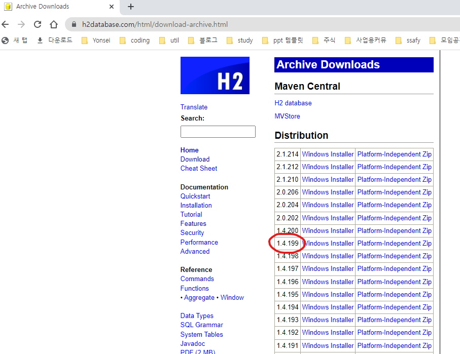
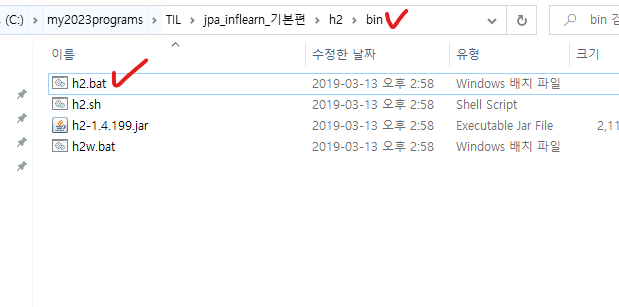
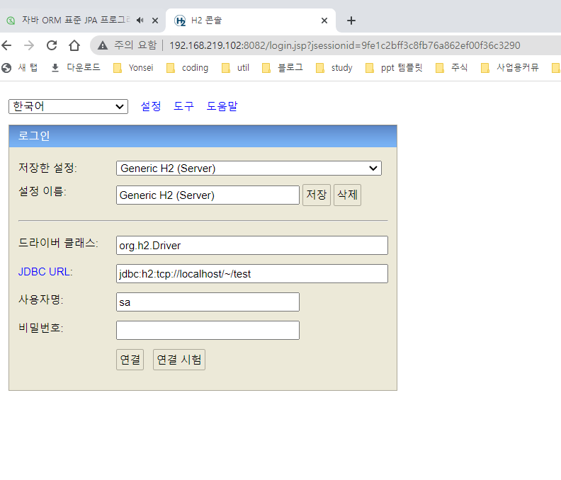
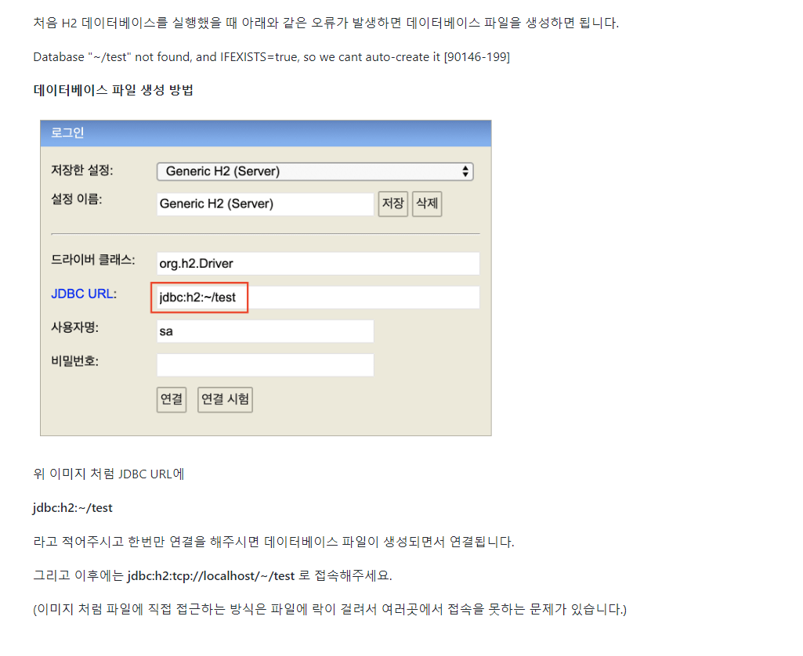
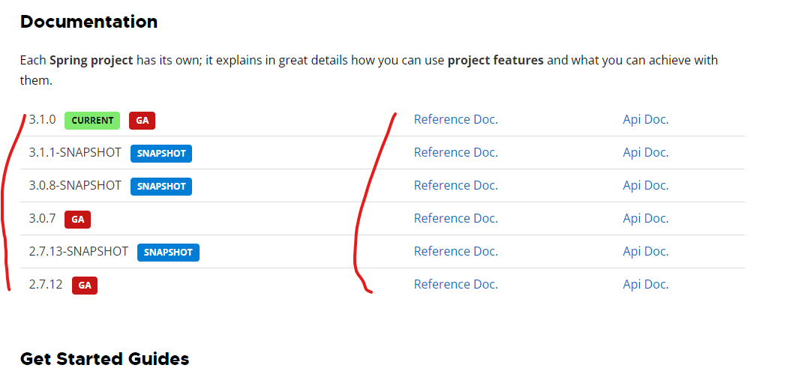
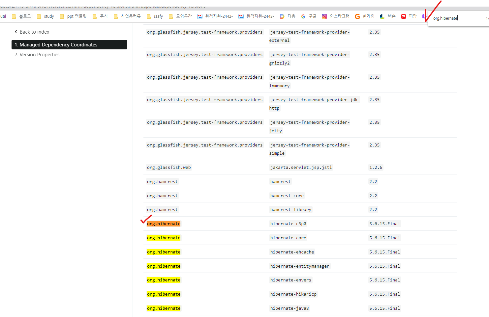
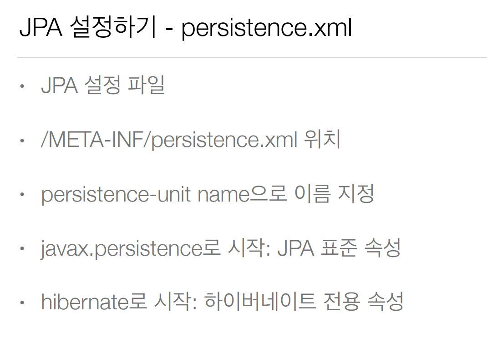
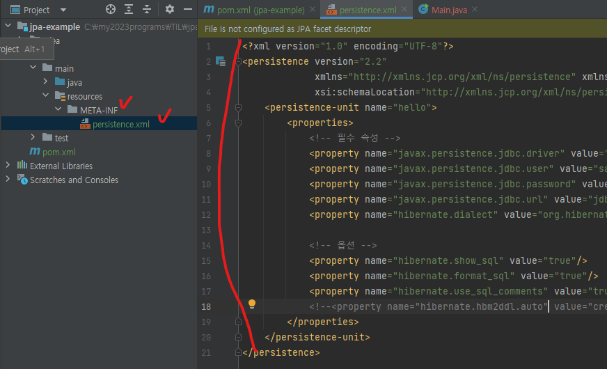
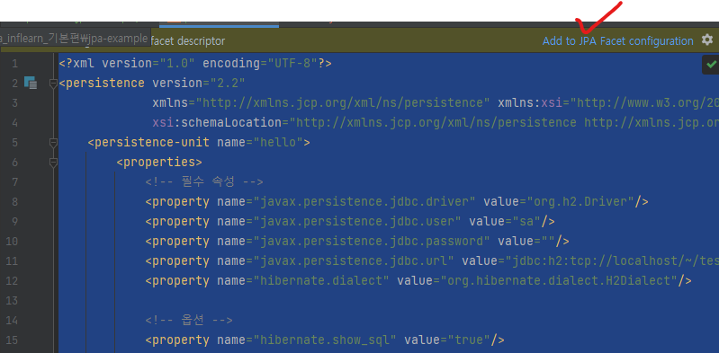
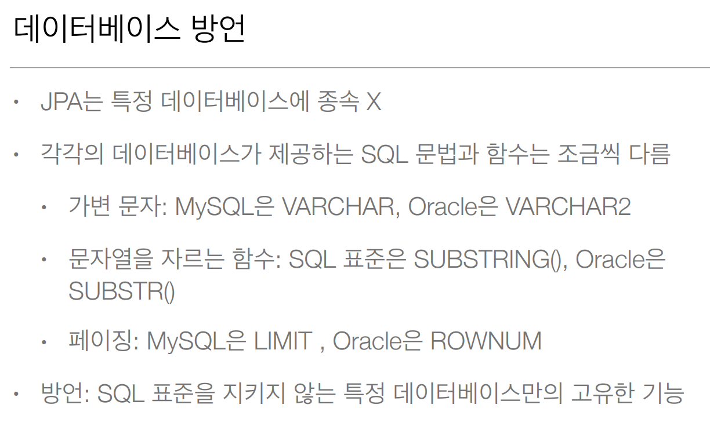

# 섹션2 - jpa 시작하기

## 1. h2 db 세팅











## 2. 프로젝트 생성


## 3. Dependency 설정

```xml
<?xml version="1.0" encoding="UTF-8"?>
<project xmlns="http://maven.apache.org/POM/4.0.0"
         xmlns:xsi="http://www.w3.org/2001/XMLSchema-instance"
         xsi:schemaLocation="http://maven.apache.org/POM/4.0.0 http://maven.apache.org/xsd/maven-4.0.0.xsd">
    <modelVersion>4.0.0</modelVersion>

    <groupId>org.example</groupId>
    <artifactId>jpa-example</artifactId>
    <version>1.0-SNAPSHOT</version>

    <properties>
        <maven.compiler.source>17</maven.compiler.source>
        <maven.compiler.target>17</maven.compiler.target>
        <project.build.sourceEncoding>UTF-8</project.build.sourceEncoding>
    </properties>
    <dependencies>
        <!-- JPA 하이버네이트 -->
        <dependency>
            <groupId>org.hibernate</groupId>
            <artifactId>hibernate-entitymanager</artifactId>
            <version>5.3.10.Final</version>
        </dependency>
        <!-- H2 데이터베이스 -->
        <dependency>
            <groupId>com.h2database</groupId>
            <artifactId>h2</artifactId>
            <version>1.4.199</version>
        </dependency>
    </dependencies>

</project>
```

### springboot까지 고려해서 라이브러리 버전 선택 방법

1. [스프링 부트 문서](https://spring.io/projects/spring-boot#learn)

2. 사용할 버전의 Referrence Doc 접속



3. hibernate dependency 확인

   

## 4. hibernate 구성

- hibernate.core
  - hibernate 필수 코어


- javax.persistence-api
  - jpa는 인터페이스고 구현체로 hibernate를 선택한것
  - persistence-api에 jpa interface가 들어있다.


## 5. JPA 설정하기 - persistence.xml

- jpa 설정 파일
- 위치가 중요
  - /META-INF의 '/'는 resources(비자바 파일의 루트)를 뜻한다.
- 



```xml
<?xml version="1.0" encoding="UTF-8"?>
<!--jpa 2.2를 쓴다는 뜻으로 볼 수 있다-->
<persistence version="2.2"
             xmlns="http://xmlns.jcp.org/xml/ns/persistence" xmlns:xsi="http://www.w3.org/2001/XMLSchema-instance"
             xsi:schemaLocation="http://xmlns.jcp.org/xml/ns/persistence http://xmlns.jcp.org/xml/ns/persistence/persistence_2_2.xsd">
    <!--    보통 데이터베이스 하나당 하나 만든다. 여기선 db 하나만 쓰니까 하나만 만든다-->
    <persistence-unit name="hello">
        <properties>
            <!-- 1. 필수 속성 - 접속 정보-->
            <property name="javax.persistence.jdbc.driver" value="org.h2.Driver"/>
            <property name="javax.persistence.jdbc.user" value="sa"/>
            <property name="javax.persistence.jdbc.password" value=""/>
            <property name="javax.persistence.jdbc.url" value="jdbc:h2:tcp://localhost/~/test"/>
            <!--중요하다-->
            <!-- 데이터베이스 방언  - 나는 h2방언을 사용해라고 알려주는 부분-->
            <property name="hibernate.dialect" value="org.hibernate.dialect.H2Dialect"/>
            <!-- 데이터베이스 방언  - 나는 mysql 방언을 사용해라고 알려주는 부분-->
<!--            <property name="hibernate.dialect" value="org.hibernate.dialect.MySQL5Dialect"/>-->
            <!-- 데이터베이스 방언  - 나는 oracle 방언을 사용해라고 알려주는 부분-->
<!--            <property name="hibernate.dialect" value="org.hibernate.dialect.Oracle12cDialect"/>-->
            <!--hibernate는 40여개 db의 방언을 지원-->


            <!-- 2. 옵션 -->
                <!-- jpa구현체를 바꾸면 hibernate.xxx에 해당하는 설정들은 다 바꿔야한다-->
            <property name="hibernate.show_sql" value="true"/><!--쿼리나가는거 확인-->
            <property name="hibernate.format_sql" value="true"/>
            <property name="hibernate.use_sql_comments" value="true"/>
            <!--<property name="hibernate.hbm2ddl.auto" value="create" />-->
        </properties>
    </persistence-unit>
</persistence>
```

- JPA 설정임을 IDE에 알려줌(자세히 모르겠다)
  - 

- 데이터베이스 방언
  - 


# ~2023-05-23

