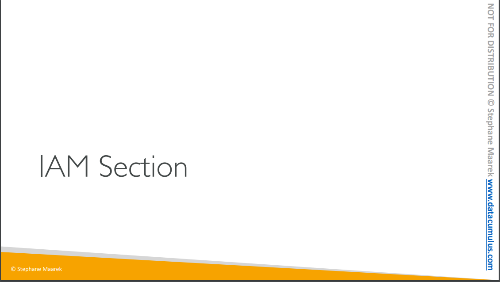
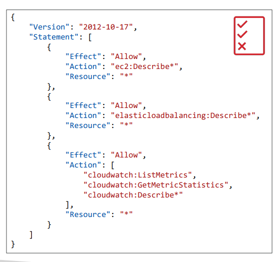

# 섹션4: IAM 및 AWS CLI

- IAM이란?
  - Identity and Access Management: 사용자를 생성하고 그룹에 배치
  - Global service: 모든 리전에서 사용 가능하다
  - 계정을 생성할 때 기본으로 root 계정이 생성되며, 이는 계정을 생성할 때만 사용되어야 한다.
    - 계정을 공유하면 안 되는 것 뿐만 아니라 사용해서도 안 된다.
      - 대신 사용자를 생성해야
      -  한다
- 사용자? 
  - 조직 내의 한 사람에 해당함
  - 사용자를 그룹으로 묶을 수 있다
  - 한 사람은 여러 그룹에 속할 수 있다
  - 그룹에는 그룹을 넣을 수 없다.
- 사용자와 그룹 생성 이유
  - 이들이 aws 계정을 사용하도록 허용하기 위해
  - 허용을 위해서 권한 부여를 해야함

## IAM: Permissions

| 사용자가 aws 계정을 사용하도록 허가

- 사용자 또는 그룹에게 정책(or iam policies)라고 불리는 json 문서를 지정할 수 있다

- 이 정책들에 대한 문서(called iam policies)를 이용해 사용자들의 권한을 정의할 수 있다.
- 개발자가 아니어도 이해 가능한 형태
- 최소 권한의 원칙: 모든 사용자에게 모든 권한 주지 않음
  - 꼭 필요한 권한만 준다